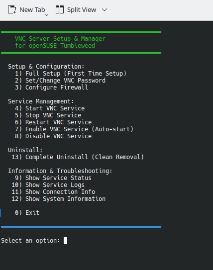
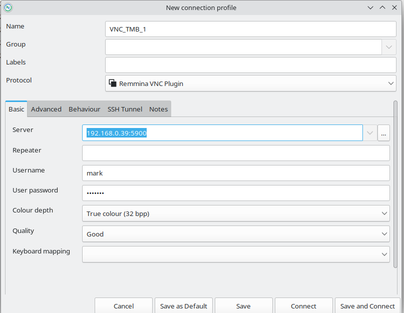

# VNC Setup Manager - Complete Guide & Documentation

<p align="center">

</p>

## Table of Contents

1. [Overview](#overview)
2. [What This Script Does](#what-this-script-does)
3. [Understanding VNC Displays](#understanding-vnc-displays)
4. [Key Concepts Explained](#key-concepts-explained)
5. [Why the Script Was Redesigned (v2.0)](#why-the-script-was-redesigned)
6. [Code Explanations](#code-explanations)
7. [Installation & Usage](#installation--usage)
8. [Troubleshooting](#troubleshooting)
9. [Advanced Configuration](#advanced-configuration)
10. [Files Created by the Script](#files-created-by-the-script)
11. [Complete Command Reference](#complete-command-reference)
12. [Frequently Asked Questions](#frequently-asked-questions)
13. [Performance Tuning](#performance-tuning)
14. [Glossary](#glossary)
15. [Changelog](#changelog)

---

## Overview

This script automates the setup and management of a VNC (Virtual Network Computing) server on openSUSE Tumbleweed. It allows you to remotely access your Linux desktop from another computer using tools like Remmina or any VNC viewer.

### What is VNC?

VNC (Virtual Network Computing) is a graphical desktop-sharing system that uses the Remote Frame Buffer (RFB) protocol to remotely control another computer. It transmits keyboard and mouse events from one computer to another, relaying the graphical screen updates back in the other direction.

### Why This Script?

Setting up VNC manually is complex and error-prone, especially on modern Linux systems with:
- Dynamic XAUTHORITY paths managed by SDDM
- SELinux enforcing mode blocking cross-context file access
- Firewall configuration
- Graphics hardware variations

This script handles all of that automatically using the most reliable approach available for KDE Plasma on openSUSE Tumbleweed — **KDE Autostart**.

---

## What This Script Does

### Automated Tasks

1. **Dependency Management**
   - Checks if TigerVNC is installed
   - Offers to install it automatically via `zypper`
   - Verifies all required components are present

2. **Graphics Detection**
   - Detects your GPU (Intel, NVIDIA, AMD)
   - Applies appropriate settings for detected hardware

3. **File Creation**
   - Creates `~/.vnc/` directory with correct permissions (700)
   - Generates password file with correct permissions (600)
   - Creates `~/.vnc/config` configuration file
   - Creates `~/.config/autostart/x0vncserver.desktop` for KDE autostart

4. **System Configuration**
   - Configures firewall to allow VNC connections on port 5900
   - Sets up KDE autostart so VNC launches at every login automatically

5. **Service Management**
   - Start/Stop/Restart VNC server for the current session
   - Enable/Disable auto-start at login
   - View status and logs
   - Complete uninstallation

---

## Understanding VNC Displays

### Two Approaches to VNC

#### 1. Virtual Desktop (vncserver)
Creates a NEW virtual desktop session separate from your physical display.

```
Your Computer:
├── Physical Display :0 (your monitor - KDE Plasma running here)
└── Virtual Display :1 (VNC creates this - new desktop session)
```

**Pros:**
- Can run a different desktop environment
- Multiple users can have separate sessions
- Continues running even if you log out physically

**Cons:**
- Black screen issues with complex desktop environments
- Need to start the desktop environment separately
- More resource intensive

#### 2. Desktop Sharing (x0vncserver) ⭐ This script uses this

Shares your EXISTING desktop that is already running on `:0`.

```
Your Computer:
└── Physical Display :0 (your monitor)
    └── x0vncserver shares THIS display via VNC
```

**Pros:**
- See exactly what is on your physical monitor
- No black screen issues
- Less resource intensive
- Easier to set up

**Cons:**
- Only works with X11 (not Wayland)
- Shows your actual desktop (not private)
- If you log out physically, VNC disconnects

### Display Numbers Explained

In X11, displays are numbered:

- `:0` = First display (usually your physical monitor)
- `:1` = Second display (virtual or second monitor)
- `:2` = Third display, etc.

VNC ports correspond to displays:
- Display `:0` → Port `5900`
- Display `:1` → Port `5901`
- Display `:2` → Port `5902`

**This script uses display `:0` (port 5900) to share your existing desktop.**

---

## Key Concepts Explained

### XAUTHORITY

**What it is:**
A file that contains authentication credentials (a "magic cookie") for X11 display access. Any program that wants to draw to the screen must present this cookie to the X server. Without it, you get the error:

```
Authorization required, but no authorization protocol specified
x0vncserver: Unable to open display ":0"
```

**The Problem on This System:**
On openSUSE Tumbleweed with SDDM, the Xauthority file is stored in a restricted directory:

```
/run/sddm/xauth_<random_suffix>
```

The random suffix (e.g. `xauth_ozzzRq`) is regenerated on every single boot. The directory permissions are:

```
drwx--x--x  root root   /run/sddm/
-rw-------  sddm sddm   xauth_ozzzRq
```

The file is owned exclusively by the `sddm` user, and SELinux enforcing mode prevents any other process — including root — from reading it across security contexts.

**How this script solves it:**
By using KDE Autostart, x0vncserver launches inside your already-authenticated graphical session. At that point, `XAUTHORITY` is already set correctly in the environment by SDDM before your desktop even appears. No manual cookie handling is needed.

### KDE Autostart

**What it is:**
A mechanism built into KDE Plasma that automatically launches applications after the desktop environment finishes loading at login.

**How it works:**
KDE reads `.desktop` files placed in `~/.config/autostart/` and executes the `Exec=` command of each one after your session is fully established. By this point, all environment variables including `DISPLAY` and `XAUTHORITY` are correctly populated.

**Why this is better than a systemd user service for VNC:**
A systemd user service starts in a clean environment before the graphical session is ready. It cannot access `XAUTHORITY` because that variable is set by SDDM only for your interactive session. KDE Autostart runs after SDDM has done all its setup work, so it inherits everything correctly.

**The autostart file location:**
```
~/.config/autostart/x0vncserver.desktop
```

### Firewall (firewalld)

**What it is:**
A security system that controls incoming and outgoing network traffic based on predetermined security rules.

**Why it matters:**
Even if VNC is running correctly, the firewall might block external connections on port 5900.

**This script opens port 5900:**
```bash
sudo firewall-cmd --permanent --add-port=5900/tcp
sudo firewall-cmd --reload
```

- `--permanent`: Save the rule so it survives reboots
- `--add-port=5900/tcp`: Allow TCP traffic on port 5900
- `--reload`: Apply the changes immediately without restarting the firewall

### SELinux

**What it is:**
Security-Enhanced Linux adds a mandatory access control layer on top of standard Unix permissions. It assigns a **security context** (label) to every file and process, and enforces rules about which contexts can interact with which others.

**Why it matters for this setup:**
On openSUSE Tumbleweed, SELinux is set to **enforcing** mode. The SDDM xauth file carries an SELinux label that restricts it to the `sddm_t` security domain. Any process outside that domain — even root — is blocked from reading it.

**Check your SELinux mode:**
```bash
sudo getenforce
# Enforcing
```

The KDE Autostart approach bypasses this entirely because x0vncserver runs as your own user in your own session context — it never needs to cross security boundaries.

---

## Why the Script Was Redesigned

Version 1.0 of this script used a **systemd user service** at `~/.config/systemd/user/x0vncserver.service` and relied on `loginctl enable-linger` to keep it running at boot.

This failed on openSUSE Tumbleweed due to a chain of three problems:

**Problem 1 — Dynamic xauth path:**
SDDM stores its xauth file at `/run/sddm/xauth_<random>` with a suffix that changes on every boot. The systemd service could not reliably find it.

**Problem 2 — Permission denied:**
The `/run/sddm/` directory and the xauth file inside it are owned by the `sddm` user. Even running as root, no other process could access them.

**Problem 3 — SELinux enforcement:**
All attempts to copy the xauth cookie across security contexts (from the sddm domain to the user session) were blocked by SELinux at the kernel level, regardless of file permissions.

Multiple workarounds were attempted — dynamic path searching, a root-level copy service, a helper script — and all were blocked at the SELinux layer.

**The solution:**
Replace the systemd service entirely with a **KDE Autostart `.desktop` file**. This launches x0vncserver from inside the fully authenticated graphical session where `XAUTHORITY` is already set, SELinux context is the user's own, and no cross-domain file access is needed.

---

## Code Explanations

### Bash Script Fundamentals

#### Shebang
```bash
#!/bin/bash
```
The very first line. Tells the operating system to use `/bin/bash` to interpret and execute this script.

#### Set Options
```bash
set -e
```
`-e` means exit immediately if any command returns a non-zero (failure) exit code. This prevents the script from continuing after an error has occurred, which could leave the system in a broken half-configured state.

#### Color Variables
```bash
RED='\033[0;31m'
GREEN='\033[0;32m'
YELLOW='\033[1;33m'
BLUE='\033[0;34m'
NC='\033[0m'  # No Color
```

These are ANSI escape codes — special sequences that terminal emulators interpret as colour instructions:
- `\033[` = Start of escape sequence (ESC character)
- `0;31m` = Colour code (0 = normal intensity, 31 = red foreground)
- `NC` = "No Colour" — resets the terminal back to its default colour

---

### Function: print_msg()

```bash
print_msg() {
    local color="$1"
    local msg="$2"

    if [ -t 2 ]; then
        echo -e "${color}${msg}${NC}" >&2
    else
        echo "$msg" >&2
    fi
}
```

**Purpose:** Print a coloured message to the terminal without interfering with captured output.

**Parameters:**
- `$1` = First positional argument (the colour variable)
- `$2` = Second positional argument (the message text)
- `local` = Scopes the variable to this function only, preventing it leaking into the rest of the script

**How it decides whether to use colour:**
- `[ -t 2 ]` tests whether file descriptor 2 (stderr) is connected to an interactive terminal
- If yes: prints with colour escape codes using `echo -e` (which interprets `\033[...]`)
- If no (e.g. output is being piped or redirected to a file): strips the colour codes and prints plain text

**Why write to stderr (`>&2`) instead of stdout?**
- **stdout** (file descriptor 1) is for data and results — things that might be captured by other commands
- **stderr** (file descriptor 2) is for diagnostics and messages
- Writing messages to stderr means they will never pollute captured output from functions like `detect_graphics()` that return a value via stdout

**Example usage:**
```bash
print_msg "$RED"   "Error: Something went wrong"
print_msg "$GREEN" "Success: Setup complete!"
print_msg "$BLUE"  "Checking dependencies..."
```

---

### Function: detect_graphics()

```bash
detect_graphics() {
    print_msg "$BLUE" "Detecting graphics hardware..."

    local gpu_info
    gpu_info=$(lspci | grep -i vga)

    local gpu_type=""
    local vnc_options=""

    if echo "$gpu_info" | grep -qi "intel.*9[0-9][0-9]"; then
        gpu_type="Intel Legacy (Gen 4-7)"
        vnc_options="-AlwaysShared"
        ...
    fi

    echo "$vnc_options"
}
```

**Purpose:** Detect which GPU is installed and return appropriate x0vncserver flags.

**`lspci`:**
Lists all devices connected to the PCI (Peripheral Component Interconnect) bus — graphics cards, network cards, storage controllers, etc.

**`grep -i vga`:**
- `grep` searches for a pattern in text
- `-i` makes the search case-insensitive
- `vga` finds lines describing graphics/video adapters

**The regex pattern `"intel.*9[0-9][0-9]"`:**
- `intel` = literal text
- `.*` = any characters (zero or more) — a wildcard
- `9[0-9][0-9]` = the digit 9 followed by any two digits (matches 900–999)
- So this matches GPU names like "Intel 965", "Intel 945GM", etc.

**Why only stdout for the return value:**
```bash
echo "$vnc_options"   # This is the return value — goes to stdout
```
All `print_msg` calls go to stderr. When this function is called with:
```bash
local vnc_opts=$(detect_graphics)
```
The `$()` command substitution captures only stdout, so `vnc_opts` gets just `-AlwaysShared`, not any of the diagnostic messages.

---

### Function: auto_install_tigervnc()

```bash
auto_install_tigervnc() {
    if command -v x0vncserver &> /dev/null; then
        print_msg "$GREEN" "TigerVNC is already installed!"
        return 0
    fi
    ...
    if command -v zypper &> /dev/null; then
        sudo zypper install -y tigervnc
    fi
}
```

**`command -v x0vncserver`:**
- `command -v` searches `$PATH` for the named executable
- Returns exit code 0 (success) if found, non-zero if not
- `&> /dev/null` silences both stdout and stderr — we only care about the exit code

**`return 0`:**
Exits the function with success code. In bash, 0 always means success.

**Package manager detection:**
The script checks for `zypper`, `apt`, `dnf`, and `pacman` in order. Whichever is found first determines how to install TigerVNC. On openSUSE Tumbleweed, `zypper` is always present.

---

### Function: create_autostart_entry()

```bash
create_autostart_entry() {
    print_msg "$BLUE" "Creating KDE autostart entry..."

    mkdir -p "$AUTOSTART_DIR"

    cat > "$AUTOSTART_FILE" << EOF
[Desktop Entry]
Type=Application
Name=x0vncserver
Comment=VNC Server for X Display
Exec=x0vncserver -display :0 -rfbport 5900 -PasswordFile $VNC_PASSWD_FILE -localhost no -AlwaysShared
Hidden=false
NoDisplay=false
X-KDE-Autostart-enabled=true
EOF

    chmod 644 "$AUTOSTART_FILE"
}
```

**Purpose:** Create the KDE autostart `.desktop` file that launches x0vncserver at every login.

**`mkdir -p "$AUTOSTART_DIR"`:**
- Creates `~/.config/autostart/` if it does not already exist
- `-p` means "create parent directories as needed" and do not error if the directory already exists

**Here Document (`<< EOF ... EOF`):**
The `cat > file << EOF` pattern writes multi-line content directly to a file:
- `cat >` writes to the file (overwriting if it exists)
- `<< EOF` starts a "here document" — everything between `<< EOF` and the closing `EOF` is treated as input to `cat`
- Variables like `$VNC_PASSWD_FILE` ARE expanded (to prevent expansion, use `<< 'EOF'` with quotes)

**The `.desktop` file format:**
This is the standard XDG desktop entry format used across Linux desktop environments. KDE reads all `.desktop` files in `~/.config/autostart/` after login and runs the `Exec=` command of each enabled one.

| Key | Purpose |
|-----|---------|
| `Type=Application` | Declares this entry launches a program |
| `Name=x0vncserver` | Display name in KDE's autostart settings panel |
| `Exec=...` | The exact command KDE runs at login |
| `Hidden=false` | When `true`, KDE completely ignores this entry |
| `NoDisplay=false` | When `true`, hides from the UI but still executes |
| `X-KDE-Autostart-enabled=true` | KDE-specific toggle flag |

**`chmod 644 "$AUTOSTART_FILE"`:**
Sets permissions to `-rw-r--r--`:
- Owner (mark): read and write
- Group: read only
- Others: read only

This is correct for a configuration file — executable permissions are not needed for `.desktop` files.

---

### Function: enable_service()

```bash
enable_service() {
    print_msg "$BLUE" "Enabling VNC autostart on login..."

    if [ ! -f "$AUTOSTART_FILE" ]; then
        create_autostart_entry
    else
        sed -i 's/^Hidden=.*/Hidden=false/' "$AUTOSTART_FILE"
        sed -i 's/^X-KDE-Autostart-enabled=.*/X-KDE-Autostart-enabled=true/' "$AUTOSTART_FILE"
        print_msg "$GREEN" "VNC autostart enabled"
    fi
}
```

**Purpose:** Make x0vncserver start automatically at the next login.

**`[ ! -f "$AUTOSTART_FILE" ]`:**
- `-f` tests whether a path exists and is a regular file
- `!` negates the test
- So: if the autostart file does NOT exist, create it from scratch

**`sed -i 's/^Hidden=.*/Hidden=false/'`:**
- `sed` is the Stream EDitor — it processes text line by line
- `-i` means edit the file in-place (modify the actual file, not just print to stdout)
- `s/pattern/replacement/` is the substitution command
- `^Hidden=` matches lines that start with `Hidden=`
- `.*` matches everything after the `=` (the current value, whatever it is)
- Replaces the entire line's value with `Hidden=false`

The second `sed` command does the same for `X-KDE-Autostart-enabled`.

**Why not just delete and recreate the file?**
Editing in-place preserves any custom settings the user may have added to the file manually.

---

### Function: disable_service()

```bash
disable_service() {
    if [ -f "$AUTOSTART_FILE" ]; then
        sed -i 's/^Hidden=.*/Hidden=true/' "$AUTOSTART_FILE"
        sed -i 's/^X-KDE-Autostart-enabled=.*/X-KDE-Autostart-enabled=false/' "$AUTOSTART_FILE"
    fi
}
```

**Purpose:** Stop x0vncserver from launching at the next login, without deleting the configuration.

Setting `Hidden=true` causes KDE to completely skip this entry when processing autostart files. The file remains on disk so it can be re-enabled at any time with option 7 — nothing is permanently lost.

---

### Function: start_service()

```bash
start_service() {
    pkill -x x0vncserver 2>/dev/null || true
    sleep 1

    nohup x0vncserver -display :0 \
        -rfbport 5900 \
        -PasswordFile "$VNC_PASSWD_FILE" \
        -localhost no \
        -AlwaysShared \
        > /tmp/x0vncserver.log 2>&1 &

    sleep 2

    if pgrep -x x0vncserver > /dev/null; then
        print_msg "$GREEN" "VNC server started! (PID: $(pgrep -x x0vncserver))"
    fi
}
```

**Purpose:** Start x0vncserver immediately for the current session.

**`pkill -x x0vncserver`:**
- `pkill` sends a signal to processes matching a name
- `-x` requires an exact name match (prevents accidentally killing unrelated processes)
- `2>/dev/null` silences the error if no process was found
- `|| true` prevents `set -e` from aborting the script if pkill finds nothing to kill

**`nohup ... &`:**
- `nohup` ("no hangup") prevents the process from dying when the terminal is closed or the script exits
- `&` runs the command in the background, returning control to the script immediately
- Together they launch a persistent background process

**`> /tmp/x0vncserver.log 2>&1`:**
- `>` redirects stdout to the log file
- `2>&1` also redirects stderr to the same place
- All output from x0vncserver is captured in `/tmp/x0vncserver.log` for troubleshooting

**`pgrep -x x0vncserver`:**
- `pgrep` searches for processes by name and returns their PIDs
- `-x` exact match
- Returns exit code 0 if found (used here to confirm successful start)

---

### Function: stop_service()

```bash
stop_service() {
    if pkill -x x0vncserver 2>/dev/null; then
        print_msg "$GREEN" "VNC server stopped"
    else
        print_msg "$YELLOW" "VNC server was not running"
    fi
}
```

**Purpose:** Stop the currently running x0vncserver process.

`pkill` returns exit code 0 if it successfully killed at least one process, and non-zero if no matching process was found. The `if` statement uses this to report whether anything was actually stopped.

---

### Function: show_service_status()

```bash
show_service_status() {
    if pgrep -x x0vncserver > /dev/null; then
        local pid
        pid=$(pgrep -x x0vncserver)
        print_msg "$GREEN" "✓ x0vncserver is RUNNING (PID: $pid)"
    else
        print_msg "$RED" "✗ x0vncserver is NOT running"
    fi

    if [ -f "$AUTOSTART_FILE" ]; then
        if grep -q "Hidden=true" "$AUTOSTART_FILE"; then
            print_msg "$YELLOW" "Autostart is DISABLED"
        else
            print_msg "$GREEN" "Autostart is ENABLED"
        fi
    fi

    if ss -tulpn 2>/dev/null | grep -q ":5900"; then
        print_msg "$GREEN" "VNC server is listening on port 5900"
    fi
}
```

**Purpose:** Report the current state of the VNC server and autostart configuration.

**`pgrep -x x0vncserver > /dev/null`:**
Checks if the process is running. Redirecting to `/dev/null` discards the PID output — we only care about the exit code (0 = found, non-zero = not found).

**`grep -q "Hidden=true"`:**
- `-q` = quiet mode, produces no output
- Returns exit code 0 if the pattern is found, non-zero if not
- Used here to check whether autostart is currently disabled

**`ss -tulpn`:**
- `ss` = socket statistics (modern replacement for `netstat`)
- `-t` = TCP sockets
- `-u` = UDP sockets
- `-l` = listening sockets only
- `-p` = show process information
- `-n` = show numeric addresses (don't resolve hostnames)

---

### Function: uninstall_vnc()

```bash
uninstall_vnc() {
    pkill -x x0vncserver 2>/dev/null && print_msg "$GREEN" "✓ VNC server stopped" || true
    rm -f "$AUTOSTART_FILE"
    rm -f "$START_SCRIPT"
    rm -rf "$VNC_DIR"
    rm -f /tmp/x0vncserver.log 2>/dev/null || true
}
```

**Purpose:** Completely remove VNC configuration and stop autostart.

**`rm -f`:** Remove file, no error if it doesn't exist (`-f` = force).

**`rm -rf`:** Remove directory and all its contents recursively. Use with care — there is no undo.

**`2>/dev/null || true`:** A safety pattern — suppress any error messages and prevent `set -e` from aborting the script if a file doesn't exist.

---

### Bash Concepts Used Throughout the Script

#### Regular Expression Matching
```bash
if [[ "$install_choice" =~ ^[Yy]$ ]]; then
```
- `[[ ]]` = bash enhanced test command, supports regex
- `=~` = regex match operator
- `^[Yy]$` = matches only the single character Y or y (nothing else)

#### Redirect Operators
```bash
command &> /dev/null    # Discard all output (stdout and stderr)
command > file          # Redirect stdout to file
command 2> file         # Redirect stderr to file
command >> file         # Append stdout to file
command 2>&1            # Redirect stderr to same place as stdout
```

#### Command Substitution
```bash
local vnc_opts=$(detect_graphics)
ip_addr=$(hostname -I | awk '{print $1}')
```
`$()` executes the command inside and captures its stdout as a string value.

#### Conditional Execution
```bash
command1 && command2   # Run command2 only if command1 succeeds
command1 || command2   # Run command2 only if command1 fails
command || true        # Always succeed even if command fails
```

#### Arrays
```bash
local deps=("x0vncserver" "vncpasswd")
for dep in "${deps[@]}"; do
    ...
done
```
- `deps=("a" "b" "c")` creates an array
- `"${deps[@]}"` expands all elements as separate quoted strings
- `${#deps[@]}` gives the number of elements

#### Test Operators
```bash
[ -f "$file" ]   # True if file exists and is a regular file
[ -d "$dir" ]    # True if directory exists
[ -z "$var" ]    # True if variable is empty (zero length)
[ -n "$var" ]    # True if variable is not empty
[ -t 2 ]         # True if file descriptor 2 (stderr) is a terminal
```

#### chmod Permission Numbers
```bash
chmod 700 "$VNC_DIR"         # rwx------  owner only
chmod 600 "$VNC_PASSWD_FILE" # rw-------  owner read/write only
chmod 644 "$AUTOSTART_FILE"  # rw-r--r--  owner rw, others read
```

Each digit is the sum of: read(4) + write(2) + execute(1). Three digits cover owner, group, and others.

---

## Installation & Usage

### Prerequisites

- openSUSE Tumbleweed with KDE Plasma desktop
- X11 session (not Wayland — see FAQ)
- sudo access
- Active network connection

### Step 1: Confirm You Are on X11

```bash
echo $XDG_SESSION_TYPE
# Must output: x11
```

If it outputs `wayland`, log out, and at the SDDM login screen click the session selector (bottom-left) and choose **Plasma (X11)**.

### Step 2: Make the Script Executable

```bash
chmod +x vnc_setup_manager.sh
```

### Step 3: Run the Script

```bash
./vnc_setup_manager.sh
```

> Do NOT run with `sudo`. The script will ask for your sudo password only when needed.

### Menu Options Explained

#### 1) Full Setup (First Time Setup)

What it does, in order:
1. Checks TigerVNC is installed (offers to install if not)
2. Creates `~/.vnc/` directory
3. Prompts you to set a VNC password
4. Creates `~/.vnc/config`
5. Creates `~/.config/autostart/x0vncserver.desktop`
6. Configures the firewall (if firewalld is running)
7. Starts x0vncserver immediately for this session

**When to use:** First time setting up VNC on this machine.

**What you will need:**
- Your sudo password (for firewall)
- A VNC password (6-8 characters recommended)

---

#### 2) Set/Change VNC Password

Re-runs `vncpasswd` to set a new password in `~/.vnc/passwd`. Use this if you forgot your VNC password or want to change it for security reasons. Does not affect the running server — restart it (option 6) for the new password to take effect.

---

#### 3) Configure Firewall

Opens port 5900 in firewalld. Only needed if firewalld is installed and running. If connections are being refused from another machine despite VNC running correctly, this is the first thing to check.

---

#### 4) Start VNC Server

Starts x0vncserver in the background for the current session using `nohup`. Output is logged to `/tmp/x0vncserver.log`. Does not affect the autostart setting.

---

#### 5) Stop VNC Server

Stops the running x0vncserver process using `pkill`. Does not affect the autostart setting.

---

#### 6) Restart VNC Server

Stops then starts x0vncserver. Use this after changing the VNC password or configuration.

---

#### 7) Enable Autostart (start at login)

Sets `Hidden=false` and `X-KDE-Autostart-enabled=true` in the `.desktop` file. VNC will start automatically at the next login. Creates the autostart file from scratch if it does not exist.

---

#### 8) Disable Autostart

Sets `Hidden=true` in the `.desktop` file. VNC will no longer start automatically at login. The configuration is preserved and can be re-enabled with option 7.

---

#### 9) Show VNC Status

Reports:
- Whether x0vncserver is currently running (and its PID)
- Whether autostart is enabled or disabled
- Whether port 5900 is currently open and listening

---

#### 10) Show Logs

Displays the last 50 lines of `/tmp/x0vncserver.log` plus any matching entries from the system journal. Use this when VNC is not connecting or crashes.

---

#### 11) Show Connection Info

Displays your machine's IP address, VNC port, and the exact settings to enter in Remmina or another VNC client.

---

#### 12) Show System Information

Displays hostname, IP address, graphics hardware, OpenGL renderer, display server type (X11 or Wayland), and desktop environment. Useful for verifying the environment before troubleshooting.

---

#### 13) Complete Uninstall

Stops x0vncserver, removes the autostart `.desktop` file, removes `~/.vnc/` and all its contents, and clears the log file. Does NOT remove the TigerVNC package or firewall rules (shown how to do manually).

---

## Connecting from a Client

### Using Remmina (Recommended)

<p align="center">

</p>

1. Open Remmina: click the `+` button to create a new connection
2. Set **Protocol** to `VNC - Virtual Network Computing`
3. Set **Server** to your machine's IP address followed by `:5900` — for example `192.168.0.39:5900`
4. Enter your VNC password
5. Set **Color Depth** to `True color (24 bpp)`
6. Click Save and Connect

Find your IP address with:
```bash
hostname -I | awk '{print $1}'
```

### Using Command Line VNC Viewer

```bash
vncviewer 192.168.0.39:5900
```

### From Windows

Use **TigerVNC Viewer** or **RealVNC Viewer**. Enter `192.168.0.39:5900` and the VNC password when prompted.

---

## Troubleshooting

### VNC Does Not Start After Reboot

**Check the autostart file exists and is enabled:**
```bash
cat ~/.config/autostart/x0vncserver.desktop
```

Look for `Hidden=false` and `X-KDE-Autostart-enabled=true`. If the file is missing, run the script and choose option 7.

**Check your session type:**
```bash
echo $XDG_SESSION_TYPE
```
Must be `x11`. If `wayland`, switch at the SDDM login screen.

**Start manually and check for errors:**
```bash
x0vncserver -display :0 -rfbport 5900 -PasswordFile ~/.vnc/passwd -localhost no -AlwaysShared
```

---

### Cannot Connect from Another Machine

**Is VNC actually running?**
```bash
pgrep -x x0vncserver
ss -tulpn | grep 5900
```

**Is the firewall blocking it?**
```bash
sudo firewall-cmd --list-ports
# Should show: 5900/tcp
```

**Open port manually if needed:**
```bash
sudo firewall-cmd --permanent --add-port=5900/tcp
sudo firewall-cmd --reload
```

**Find your correct IP:**
```bash
hostname -I
```

---

### Black Screen When Connected

Usually means x0vncserver started before the desktop finished loading, or you are on Wayland.

```bash
echo $XDG_SESSION_TYPE   # Must be x11
```

If on X11, try disconnecting and reconnecting after waiting 10-15 seconds from login.

---

### Authorization / Display Errors in Logs

```
Authorization required, but no authorization protocol specified
x0vncserver: Unable to open display ":0"
```

This means x0vncserver was started outside of a proper graphical session — for example from a terminal before logging into the desktop, or via a broken systemd service. The fix is to ensure VNC is launched via KDE Autostart only (the default in v2.0). Run option 13 (Uninstall) then option 1 (Full Setup) to reset cleanly.

---

### Password Not Working

```bash
# Recreate the password file
vncpasswd ~/.vnc/passwd
chmod 600 ~/.vnc/passwd
# Then restart VNC (option 6)
```

---

### Slow Performance

In Remmina, try:
- **Color Depth:** High color (16 bpp) or 256 colors (8 bpp)
- **Quality:** Poor or Medium
- **Enable compression:** checked

---

## Advanced Configuration

### Changing the VNC Port

Edit the autostart file:
```bash
nano ~/.config/autostart/x0vncserver.desktop
```

Change `-rfbport 5900` to your preferred port, e.g. `-rfbport 5901`.

Open the new port in the firewall:
```bash
sudo firewall-cmd --permanent --add-port=5901/tcp
sudo firewall-cmd --reload
```

Then stop and start VNC (options 5 and 4).

### Adding Custom x0vncserver Flags

Edit the `Exec=` line in `~/.config/autostart/x0vncserver.desktop`:

```ini
Exec=x0vncserver -display :0 -rfbport 5900 -PasswordFile /home/mark/.vnc/passwd -localhost no -AlwaysShared -MaxProcessorUsage 50
```

Available flags include:
- `-MaxProcessorUsage 50` — limit CPU usage to 50%
- `-DeferUpdate 50` — wait 50ms between screen updates (reduces CPU at cost of smoothness)
- `-Log *:stderr:30` — more verbose logging

### Security: SSH Tunnel

For encrypted remote access, tunnel VNC through SSH:

On the client machine:
```bash
ssh -L 5900:localhost:5900 mark@server-ip
```

Then connect your VNC client to `localhost:5900`. All traffic is encrypted by SSH.

---

## Files Created by the Script

| File | Purpose | Permissions |
|------|---------|-------------|
| `~/.vnc/passwd` | Encrypted VNC password (binary) | `600` (rw-------) |
| `~/.vnc/config` | VNC server settings | `644` (rw-r--r--) |
| `~/.config/autostart/x0vncserver.desktop` | KDE autostart entry | `644` (rw-r--r--) |
| `/tmp/x0vncserver.log` | Runtime log (cleared on reboot) | auto |

### ~/.vnc/config Contents

```ini
# VNC Server Configuration
securitytypes=vncauth
geometry=1920x1080
localhost=no
alwaysshared
```

| Setting | Meaning |
|---------|---------|
| `securitytypes=vncauth` | Use password authentication |
| `geometry=1920x1080` | Resolution hint for virtual desktops (informational for x0vncserver) |
| `localhost=no` | Accept connections from other machines |
| `alwaysshared` | Allow multiple VNC clients to connect at once |

### ~/.config/autostart/x0vncserver.desktop Contents

```ini
[Desktop Entry]
Type=Application
Name=x0vncserver
Comment=VNC Server for X Display
Exec=x0vncserver -display :0 -rfbport 5900 -PasswordFile /home/mark/.vnc/passwd -localhost no -AlwaysShared
Hidden=false
NoDisplay=false
X-KDE-Autostart-enabled=true
```

---

## Complete Command Reference

### VNC Process Commands

```bash
# Check if VNC is running
pgrep -x x0vncserver

# Start manually
nohup x0vncserver -display :0 -rfbport 5900 -PasswordFile ~/.vnc/passwd -localhost no -AlwaysShared > /tmp/x0vncserver.log 2>&1 &

# Stop VNC
pkill -x x0vncserver

# View live log
tail -f /tmp/x0vncserver.log
```

### Autostart Management

```bash
# View autostart file
cat ~/.config/autostart/x0vncserver.desktop

# Enable autostart manually
sed -i 's/^Hidden=.*/Hidden=false/' ~/.config/autostart/x0vncserver.desktop
sed -i 's/^X-KDE-Autostart-enabled=.*/X-KDE-Autostart-enabled=true/' ~/.config/autostart/x0vncserver.desktop

# Disable autostart manually
sed -i 's/^Hidden=.*/Hidden=true/' ~/.config/autostart/x0vncserver.desktop
```

### Firewall Commands

```bash
sudo firewall-cmd --list-ports                          # View open ports
sudo firewall-cmd --permanent --add-port=5900/tcp       # Open port 5900
sudo firewall-cmd --permanent --remove-port=5900/tcp    # Close port 5900
sudo firewall-cmd --reload                              # Apply changes
sudo firewall-cmd --list-all                            # Full firewall config
```

### Network Diagnostic Commands

```bash
ss -tulpn | grep 5900       # Is port 5900 listening?
hostname -I                 # Your IP address
ping [server-ip]            # Test basic connectivity
nc -zv [server-ip] 5900    # Test VNC port specifically
```

### File Permission Commands

```bash
ls -la ~/.vnc/
chmod 700 ~/.vnc
chmod 600 ~/.vnc/passwd
chmod 644 ~/.vnc/config
chmod 644 ~/.config/autostart/x0vncserver.desktop
```

### Quick Reference Card

```bash
# Start VNC Manager
./vnc_setup_manager.sh

# Quick manual start
x0vncserver -display :0 -rfbport 5900 -PasswordFile ~/.vnc/passwd -localhost no -AlwaysShared &

# Check VNC is running
pgrep -x x0vncserver

# View logs
tail -f /tmp/x0vncserver.log

# Find your IP
hostname -I | awk '{print $1}'

# Check port is open
ss -tulpn | grep 5900
```

### Emergency Recovery

```bash
# Kill all VNC processes
pkill -9 x0vncserver

# Check session type (must be x11)
echo $XDG_SESSION_TYPE

# Check autostart file
cat ~/.config/autostart/x0vncserver.desktop

# Full reset: uninstall then fresh setup
./vnc_setup_manager.sh   # Option 13, then Option 1
```

---

## Frequently Asked Questions

### Q: Will this work on other Linux distributions?

**A:** The KDE Autostart approach works on any system running KDE Plasma (and most other desktop environments that honour the XDG autostart spec). The package manager detection in the script supports `zypper`, `apt`, `dnf`, and `pacman`. The main requirement is KDE Plasma on X11.

### Q: Can I use this with Wayland?

**A:** No. `x0vncserver` requires X11. At the SDDM login screen, select **Plasma (X11)** instead of **Plasma (Wayland)**. Alternatively, `wayvnc` can be used with Wayland but requires a completely different setup not covered by this script.

### Q: Why not use a systemd user service?

**A:** On openSUSE Tumbleweed with SDDM and SELinux enforcing, systemd user services cannot access the XAUTHORITY file that SDDM creates for the X session. The file is locked to the `sddm` security context and no cross-domain access is permitted. KDE Autostart bypasses this entirely by launching inside the already-authenticated session.

### Q: Does this work with multiple monitors?

**A:** Yes. `x0vncserver` shares the entire display `:0`, which spans all monitors. The VNC client will show your full desktop across all screens.

### Q: Can multiple people connect simultaneously?

**A:** Yes. The `-AlwaysShared` flag (enabled by default) allows multiple VNC clients to connect at the same time. All connections see and can control the same desktop.

### Q: Is this secure?

**A:** It provides basic security — password protection and firewall rules. For better security over untrusted networks, use an SSH tunnel to encrypt all VNC traffic. Do not expose port 5900 directly to the internet without a tunnel.

### Q: Can I run this on a headless server?

**A:** No. `x0vncserver` requires an existing X11 display. For headless servers, use `Xvnc` to create a virtual framebuffer display — this is a different setup not covered by this script.

---

## Performance Tuning

### Reduce CPU Usage

Edit the `Exec=` line in the autostart file to add:

```ini
Exec=x0vncserver ... -MaxProcessorUsage 50 -DeferUpdate 50
```

- `-MaxProcessorUsage 50` caps CPU at 50%
- `-DeferUpdate 50` reduces update frequency (50ms between frames)

### Reduce Bandwidth

In `~/.vnc/config`:
```ini
ZlibLevel=6    # Compression level 1-9 (higher = more CPU, less bandwidth)
```

### Client-Side (Remmina)

- Color Depth: 256 colors (8 bpp) for slow connections
- Quality: Poor or Medium
- Enable compression: checked
- Disable wallpaper display: checked (if available)

---

## Glossary

**ANSI:** American National Standards Institute — defines escape codes for terminal colors

**Autostart:** KDE mechanism that launches applications after desktop login

**Bash:** Bourne Again Shell — the default shell on most Linux systems

**Desktop Entry (.desktop):** Standard XDG file format for launching applications

**Display:** In X11, a connection to an X server, numbered `:0`, `:1`, etc.

**Exit Code:** Number returned by a command (0 = success, non-zero = failure)

**Firewalld:** Dynamic firewall management tool used on openSUSE and Fedora-based systems

**Heredoc:** Here Document — multi-line string embedded in a shell script using `<< EOF`

**KDE Plasma:** The desktop environment used on this system

**nohup:** "No hangup" — prevents a process from terminating when the controlling terminal closes

**PCI:** Peripheral Component Interconnect — internal computer bus (used by `lspci` to list hardware)

**pgrep / pkill:** Process search and signal tools that match by process name

**Port:** Network endpoint identified by number (VNC uses 5900 by default)

**RFB:** Remote Framebuffer Protocol — the protocol VNC uses to transmit screen data

**SDDM:** Simple Desktop Display Manager — the login screen manager on KDE systems

**sed:** Stream EDitor — processes and transforms text, used here to edit `.desktop` files in-place

**SELinux:** Security-Enhanced Linux — mandatory access control system enforced at the kernel level

**Shebang:** First line of a script (`#!/bin/bash`) declaring which interpreter to use

**ss:** Socket Statistics — modern replacement for `netstat`

**Stderr:** Standard Error (file descriptor 2) — used for diagnostic messages

**Stdin:** Standard Input (file descriptor 0) — used for reading input

**Stdout:** Standard Output (file descriptor 1) — used for normal output and return values

**VNC:** Virtual Network Computing — remote desktop sharing protocol

**X11:** X Window System version 11 — the display server protocol required by this script

**XAUTHORITY:** File containing the magic cookie credentials for X11 display access

**Wayland:** Modern display server protocol that replaces X11 (not compatible with x0vncserver)

**XDG:** X Desktop Group — standards body defining `.desktop` file format and autostart behaviour

---

## Additional Resources

### Official Documentation

- [TigerVNC Website](https://tigervnc.org/)
- [TigerVNC GitHub](https://github.com/TigerVNC/tigervnc)
- [RFB Protocol Specification](https://github.com/rfbproto/rfbproto)
- [Firewalld Documentation](https://firewalld.org/documentation/)
- [XDG Autostart Specification](https://specifications.freedesktop.org/autostart-spec/autostart-spec-latest.html)

### Community Resources

- [Arch Wiki - TigerVNC](https://wiki.archlinux.org/title/TigerVNC)
- [openSUSE VNC Documentation](https://doc.opensuse.org/)
- [KDE Autostart Documentation](https://userbase.kde.org/System_Settings/Autostart)

### Learning Bash

- [Bash Guide for Beginners](https://tldp.org/LDP/Bash-Beginners-Guide/html/)
- [Advanced Bash-Scripting Guide](https://tldp.org/LDP/abs/html/)
- [ShellCheck](https://www.shellcheck.net/) — Online bash syntax checker

---

## Changelog

### Version 2.0 (Current)

- **Replaced systemd user service with KDE Autostart** — resolves xauth/SELinux issues on openSUSE Tumbleweed with SDDM
- **Removed** `~/start-vnc.sh` startup script (no longer needed)
- **Removed** `loginctl enable-linger` (not needed with autostart approach)
- **Removed** all `systemctl --user` commands
- **Added** `create_autostart_entry()` — creates `~/.config/autostart/x0vncserver.desktop`
- **Updated** `enable_service()` — edits `Hidden` and `X-KDE-Autostart-enabled` flags in-place using `sed`
- **Updated** `disable_service()` — sets `Hidden=true` without deleting the file
- **Updated** `start_service()` — uses `nohup` and `pgrep` instead of systemctl
- **Updated** `stop_service()` — uses `pkill` instead of systemctl
- **Updated** `show_service_status()` — uses `pgrep` and reads `.desktop` file state
- **Updated** `show_logs()` — reads `/tmp/x0vncserver.log` and system journal
- **Updated** `uninstall_vnc()` — removes autostart file instead of systemd service

### Version 1.0

- Initial release
- Auto-detect and install TigerVNC
- Graphics hardware detection
- Dynamic XAUTHORITY handling (attempted)
- Systemd user service setup
- Firewall configuration
- Complete uninstall option
- Menu-driven interface

---

## Credits & License

**Created by:** Mark  
**Tested on:** openSUSE Tumbleweed, KDE Plasma, SDDM, SELinux enforcing  
**License:** Free to use, modify, and distribute

**Special thanks to:** TigerVNC developers and the openSUSE community

---

**End of Documentation**
